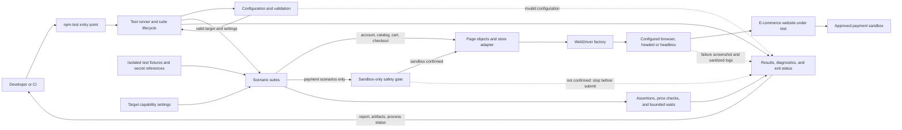

# E-commerce Test System Architecture

**Status:** Proposed architecture based on the current requirements. The target store and browser matrix are not yet configured. This document describes the planned system; it does not imply that the framework has been implemented.

## Architecture Diagram



## Component Responsibilities

| Layer | Components | Responsibility | Requirements |
| --- | --- | --- | --- |
| Entry and orchestration | `npm test`, test runner | Start the suite, select scenarios, manage per-test setup/teardown, and return a reliable process status. The repository has no configured runner yet; Node.js `node:test` is a lightweight initial option. | HLR-002, HLR-011, HLR-012 |
| Configuration | Configuration loader, target capability settings | Load and validate target URL, browser mode, timeouts, feature support, and secret references. Fail before browser interaction when required settings are missing or malformed. | HLR-001, HLR-002 |
| Scenario layer | Authentication, catalog, product, cart, checkout, payment suites | Describe end-to-end customer behavior and expected outcomes. Skip or adapt optional behaviors such as coupons, filters, logout, and variants when unsupported by the configured store. | HLR-003 through HLR-010 |
| Test data | Fixtures and safe account data | Provide repeatable product, price, address, and sandbox test data. Keep runtime fixtures separate from the requirements CSVs; never commit real credentials or payment data. | HLR-001, HLR-005 through HLR-009, HLR-011 |
| Browser interaction | Page objects, store adapter, WebDriver factory | Keep target-specific locators/actions out of scenario logic; use stable selectors, condition-based waits, configured browser options, and guaranteed driver cleanup. | HLR-002 through HLR-010, HLR-011 |
| Verification | Assertions, price checks, bounded waits | Fail tests on unmet UI or business expectations, including product/cart/checkout totals and visible success or error states. | HLR-003 through HLR-011 |
| Payment safety | Sandbox-only safety gate | Allow payment scenarios to submit only provider-issued test data to an explicitly confirmed sandbox/test environment. Block submission if the environment cannot be verified. | HLR-009, HLR-010 |
| Reporting | Results, diagnostics, artifacts | Summarize pass/fail/skip, capture sanitized failure diagnostics, and produce a nonzero process status for failed tests or invalid setup. | HLR-011, HLR-012 |

## Execution Flow

1. A developer or CI system invokes `npm test`.
2. The runner loads configuration and validates the target URL, browser options, required fixtures, and environment settings. Invalid configuration fails before browser interaction.
3. The runner selects tests according to the target's configured capabilities and creates isolated test data and a fresh WebDriver session per test.
4. Scenario suites use page objects to interact with the store. Assertions and bounded waits verify visible states and business outcomes.
5. A payment scenario must pass the sandbox-only gate before submitting provider-issued test data. If sandbox status is unconfirmed, submission is blocked.
6. Teardown closes the browser and attempts permitted data cleanup. Failures include sanitized diagnostics; the run reports the outcome and exits nonzero.

## Proposed Module Layout

```text
Practice_EShop/
  architecture.md
  requirements/                  # planning specifications only
  src/
    config/                       # environment and capability validation
    pages/                        # target-specific page objects
    support/                      # driver, waits, fixtures, safety, reporting
  test/
    auth/
    catalog/
    cart/
    checkout/
  artifacts/                      # generated diagnostics; no secrets
```

The requirements documents are [high-level requirements](requirements/high_level_requirements.csv) and [low-level requirements](requirements/low_level_requirements.csv). Implementation tests should reference their LLR IDs in test names or metadata for traceability.